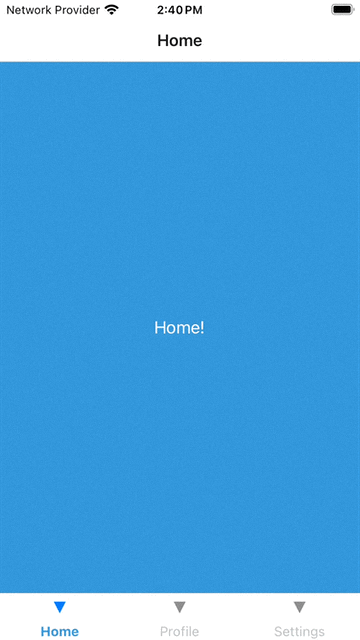

# React Native Tab Navigation Demo

<div style="display: flex; justify-content: space-between; align-items: center; width: 100%;">
   


  
</div>


## Description

This is a simple React Native app that demonstrates the usage of Tab Navigation using the `@react-navigation` library. The app consists of three tabs: Home, Profile, and Settings, each with its own unique screen.

This is a new [**React Native**](https://reactnative.dev) project, bootstrapped using [`@react-native-community/cli`](https://github.com/react-native-community/cli).

# Getting Started

>**Note**: Make sure you have completed the [React Native - Environment Setup](https://reactnative.dev/docs/environment-setup) instructions till "Creating a new application" step, before proceeding.

## Step 1: Start the Metro Server

First, you will need to start **Metro**, the JavaScript _bundler_ that ships _with_ React Native.

To start Metro, run the following command from the _root_ of your React Native project:

```bash
# using npm
npm start

# OR using Yarn
yarn start
```

## Step 2: Start your Application

Let Metro Bundler run in its _own_ terminal. Open a _new_ terminal from the _root_ of your React Native project. Run the following command to start your _Android_ or _iOS_ app:

### For Android

```bash
# using npm
npm run android

# OR using Yarn
yarn android
```

### For iOS

```bash
# using npm
npm run ios

# OR using Yarn
yarn ios
```

If everything is set up _correctly_, you should see your new app running in your _Android Emulator_ or _iOS Simulator_ shortly provided you have set up your emulator/simulator correctly.

This is one way to run your app — you can also run it directly from within Android Studio and Xcode respectively.

## Step 3: Modifying your App

Now that you have successfully run the app, let's modify it.

1. Open `App.tsx` in your text editor of choice and edit some lines.
2. For **Android**: Press the <kbd>R</kbd> key twice or select **"Reload"** from the **Developer Menu** (<kbd>Ctrl</kbd> + <kbd>M</kbd> (on Window and Linux) or <kbd>Cmd ⌘</kbd> + <kbd>M</kbd> (on macOS)) to see your changes!

   For **iOS**: Hit <kbd>Cmd ⌘</kbd> + <kbd>R</kbd> in your iOS Simulator to reload the app and see your changes!

## Congratulations! :tada:

You've successfully run and modified your React Native App. :partying_face:

### Now what?

- If you want to add this new React Native code to an existing application, check out the [Integration guide](https://reactnative.dev/docs/integration-with-existing-apps).
- If you're curious to learn more about React Native, check out the [Introduction to React Native](https://reactnative.dev/docs/getting-started).

# Troubleshooting

If you can't get this to work, see the [Troubleshooting](https://reactnative.dev/docs/troubleshooting) page.

# Learn More

To learn more about React Native, take a look at the following resources:

- [React Native Website](https://reactnative.dev) - learn more about React Native.
- [Getting Started](https://reactnative.dev/docs/environment-setup) - an **overview** of React Native and how setup your environment.
- [Learn the Basics](https://reactnative.dev/docs/getting-started) - a **guided tour** of the React Native **basics**.
- [Blog](https://reactnative.dev/blog) - read the latest official React Native **Blog** posts.
- [`@facebook/react-native`](https://github.com/facebook/react-native) - the Open Source; GitHub **repository** for React Native.


<!-- // import React from 'react';

// import { Text, View, StyleSheet } from 'react-native';

// import { NavigationContainer } from '@react-navigation/native';

// import { createBottomTabNavigator } from '@react-navigation/bottom-tabs';


// const Tab = createBottomTabNavigator();


// const App = () => {

//   return (

//     <NavigationContainer>

//       <Tab.Navigator

//         screenOptions={({ route }) => ({

//           tabBarLabel: ({ focused }) => (

//             <Text style={{ fontWeight: focused ? 'bold' : 'normal', color: focused ? '#3498db' : '#bdc3c7' }}>

//               {route.name}

//             </Text>

//           ),

//         })}

//       >

//         <Tab.Screen name='Home' component={HomeScreen} />

//         <Tab.Screen name='Profile' component={ProfileScreen} />

//         <Tab.Screen name='Settings' component={SettingsScreen} />

//       </Tab.Navigator>

//     </NavigationContainer>

//   );

// };


// const HomeScreen = () => {

//   return (

//     <View style={[styles.container, { backgroundColor: '#3498db' }]}>

//       <Text style={styles.text}>Home!</Text>

//     </View>

//   );

// };


// const ProfileScreen = () => {

//   return (

//     <View style={[styles.container, { backgroundColor: '#2ecc71' }]}>

//       <Text style={styles.text}>Profile!</Text>

//     </View>

//   );

// };


// const SettingsScreen = () => {

//   return (

//     <View style={[styles.container, { backgroundColor: '#e74c3c' }]}>

//       <Text style={styles.text}>Settings!</Text>

//     </View>

//   );

// };


// const styles = StyleSheet.create({

//   container: {

//     flex: 1,

//     justifyContent: 'center',

//     alignItems: 'center',

//   },

//   text: {

//     color: '#fff',

//     fontSize: 18,

//   },

// });


// export default App;


// import React from 'react';

// import { Text, View, StyleSheet } from 'react-native';

// import { NavigationContainer } from '@react-navigation/native';

// import { createBottomTabNavigator } from '@react-navigation/bottom-tabs';


// const Tab = createBottomTabNavigator();


// const App = () => {

//   return (

//     <NavigationContainer>

//       <Tab.Navigator

//         screenOptions={({ route }) => ({

//           tabBarLabel: ({ focused }) => (

//             <Text style={{ fontWeight: focused ? 'bold' : 'normal', color: focused ? '#3498db' : '#bdc3c7' }}>

//               {route.name}

//             </Text>

//           ),

//         })}

//       >

//         <Tab.Screen

//           name='Home'

//           component={HomeScreen}

//           options={{ tabBarIcon: () => <Text>🏠</Text> }}

//         />

//         <Tab.Screen

//           name='Profile'

//           component={ProfileScreen}

//           options={{ tabBarIcon: () => <Text>👤</Text> }}

//         />

//         <Tab.Screen

//           name='Settings'

//           component={SettingsScreen}

//           options={{ tabBarIcon: () => <Text>⚙️</Text> }}

//         />

//       </Tab.Navigator>

//     </NavigationContainer>

//   );

// };


// const HomeScreen = () => {

//   return (

//     <View style={[styles.container, { backgroundColor: '#3498db' }]}>

//       <Text style={styles.text}>Home!</Text>

//     </View>

//   );

// };


// const ProfileScreen = () => {

//   return (

//     <View style={[styles.container, { backgroundColor: '#2ecc71' }]}>

//       <Text style={styles.text}>Profile!</Text>

//     </View>

//   );

// };


// const SettingsScreen = () => {

//   return (

//     <View style={[styles.container, { backgroundColor: '#e74c3c' }]}>

//       <Text style={styles.text}>Settings!</Text>

//     </View>

//   );

// };


// const styles = StyleSheet.create({

//   container: {

//     flex: 1,

//     justifyContent: 'center',

//     alignItems: 'center',

//   },

//   text: {

//     color: '#fff',

//     fontSize: 18,

//   },

// });


// export default App;


-->
